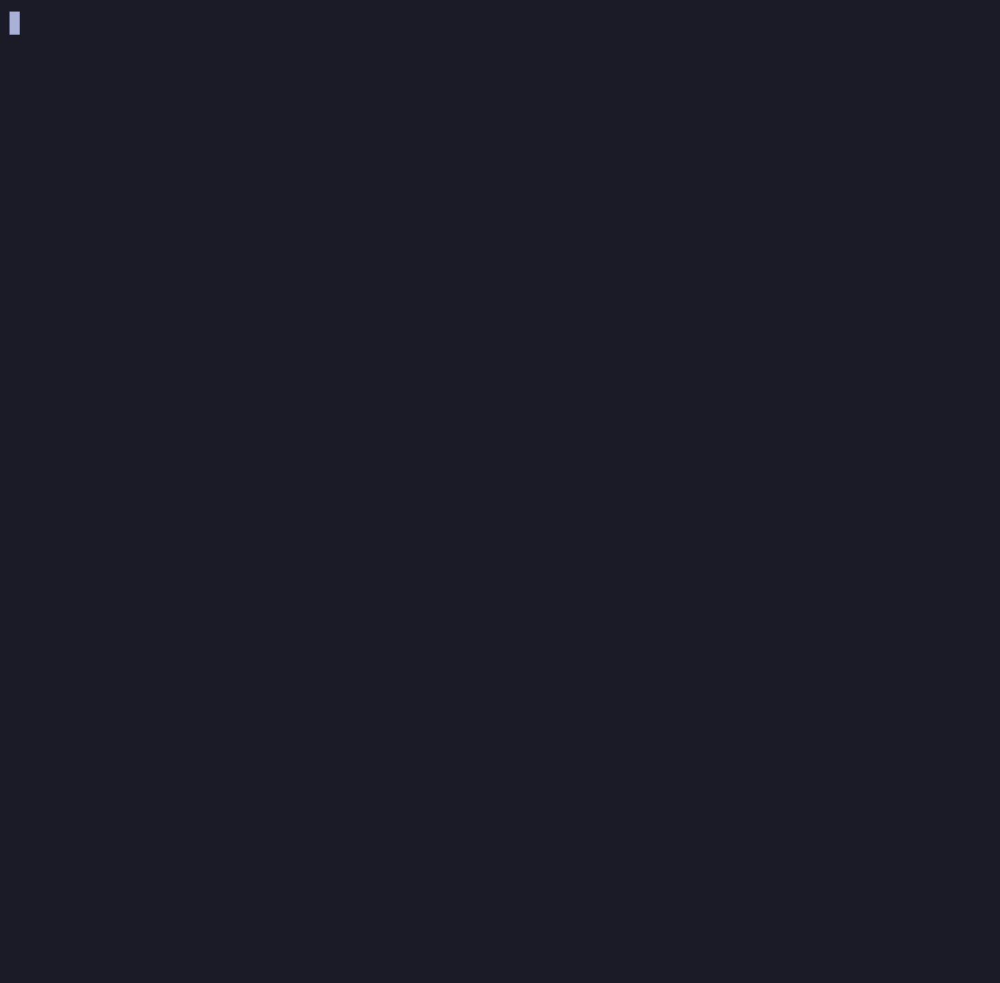

# FoodAlert - CLI

FoodAlert - CLI is a simple CLI for tracking Foodsi offers, (support multiple users). The application saves the latest offer status in a local SQLite database and issues alerts.

Get current offers:


Add restaurants to favorite:


## Motivation

Tired of constantly checking Foodsi to see if your favorite restaurant has added a new offer? Are others snapping up the best deals before you?
FoodAlert solves this problem. By receiving real-time information about new food boxes, you'll never be outdone again.

## Description

- Supports multiple Foodsi accounts in a single CLI
- Allows you to run a single fetch or a recurring offer check
- Saves current offers per user
- Reports changes to offer availability in the console
- Allows you to manage your list of favorite and ignored restaurants
- Allows you to enable notifications only for your favorite restaurants

## Quick Start

Requirements:

- Node.js 20+
- npm

Installation and start:

```bash
npm install
npm run dev
```

When you run the application for the first time, it will create a local `foodalert.sqlite` database in the project directory.

## Usage

Once launched, you'll see an interactive menu in the terminal.

1. Go to `Users` and add a Foodsi account.
2. Run `Run once for user` to retrieve the first offer status.
3. Go to `Offers` to view the current saved offers for the selected user.
4. Go to `Restaurants` to add restaurants to `favorites` or `ignored`.
5. Go to `Settings` if you want to set a custom check interval or enable `favorites only` mode.
6. Run `Watch one user` or `Watch all users` to have the application check offers periodically.
7. Use `Status` to view active watchers and `Stop watchers` to stop them.

Alerts appear directly in the console. The app detects:

- new offer
- offer back in stock
- sold out
- change in available items

## Contributing

If you'd like to contribute, please fork the repository and open a pull request to the `main` branch.
