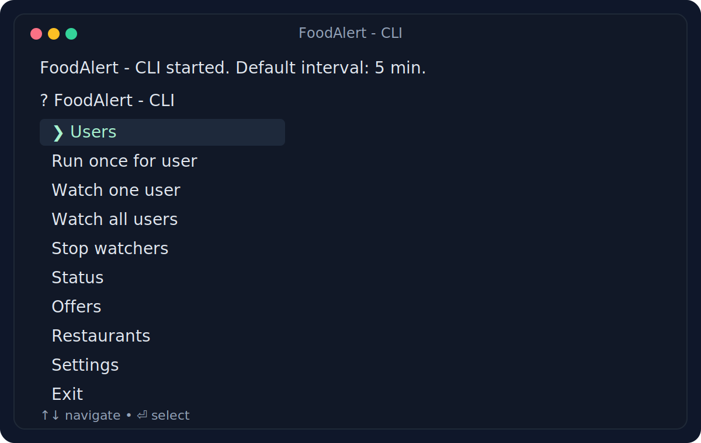
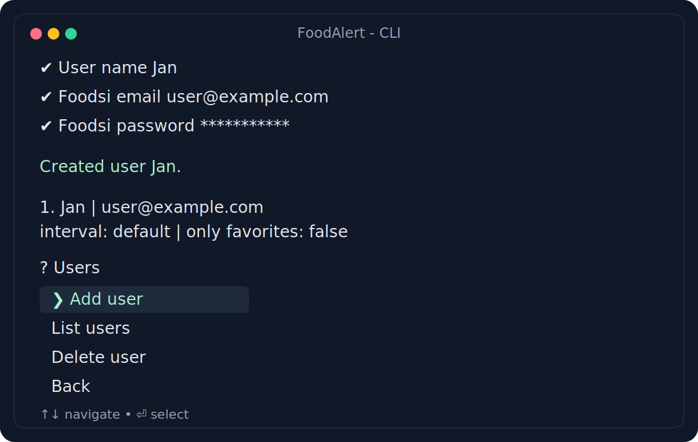
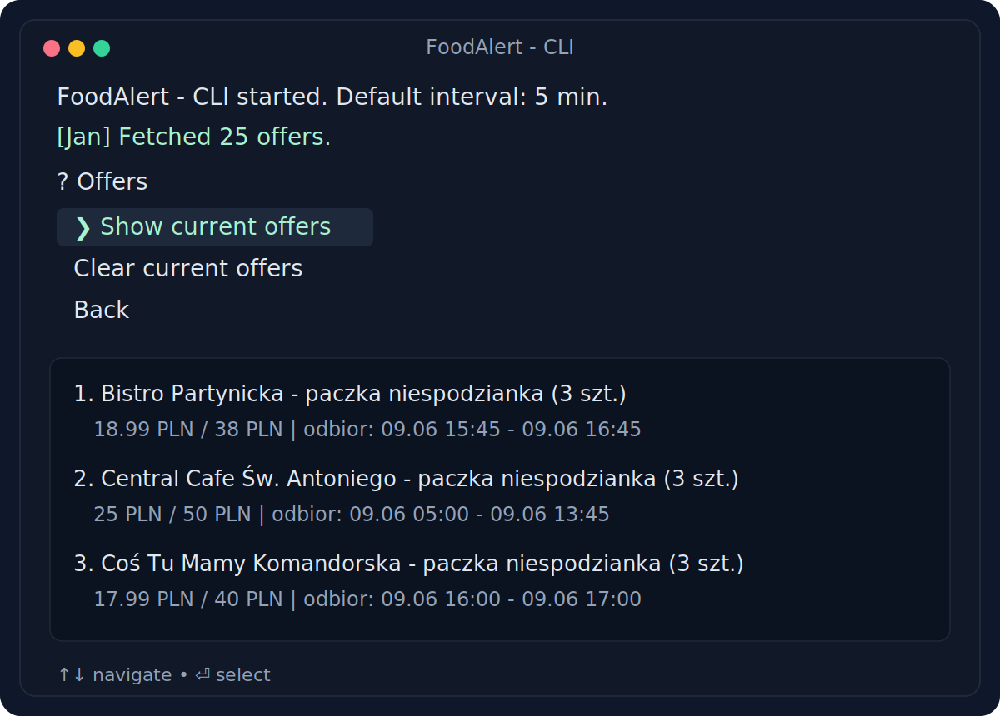

# FoodAlert

FoodAlert to proste CLI do śledzenia ofert z Foodsi nawet dla wielu użytkowników. Aplikacja zapisuje ostatni stan ofert w lokalnej bazie SQLite i wypisuje alerty, gdy pojawia się nowa oferta. Użytkownik może dodać restauracje do listy `favorites` i otrzymywać alerty o ofertach tylko z tych miejsc albo do listy `ignored` aby nigdy nie dostawać od nich ofert.







## Co robi aplikacja

- obsługuje wiele kont Foodsi w jednym CLI
- pozwala uruchomić pojedynczy fetch albo cykliczne sprawdzanie ofert
- zapisuje bieżące oferty per użytkownik
- zgłasza zmiany dostępności ofert w konsoli
- pozwala zarządzać listą ulubionych i ignorowanych restauracji
- pozwala włączyć powiadomienia tylko dla ulubionych restauracji

## Szybki start

Wymagania:

- Node.js 20+
- npm

Instalacja i start:

```bash
npm install
npm run dev
```

Przy pierwszym uruchomieniu aplikacja utworzy lokalną bazę `foodalert.sqlite` w katalogu projektu.

## Jak korzystać

Po uruchomieniu zobaczysz interaktywne menu w terminalu.

1. Wejdź w `Users` i dodaj konto Foodsi.
2. Uruchom `Run once for user`, żeby pobrać pierwszy stan ofert.
3. Wejdź w `Offers`, żeby zobaczyć zapisane aktualne oferty dla wybranego użytkownika.
4. Wejdź w `Restaurants`, żeby dodać restauracje do `favorites` albo `ignored`.
5. Wejdź w `Settings`, jeśli chcesz ustawić własny interwał sprawdzania albo włączyć tryb `only favorites`.
6. Uruchom `Watch one user` albo `Watch all users`, żeby aplikacja sprawdzała oferty cyklicznie.
7. Użyj `Status`, żeby podejrzeć aktywne watchery, i `Stop watchers`, żeby je zatrzymać.

Alerty pojawiają się bezpośrednio w konsoli. Aplikacja wykrywa:

- nową ofertę
- powrót oferty na stan
- wyprzedanie
- zmianę liczby dostępnych sztuk
